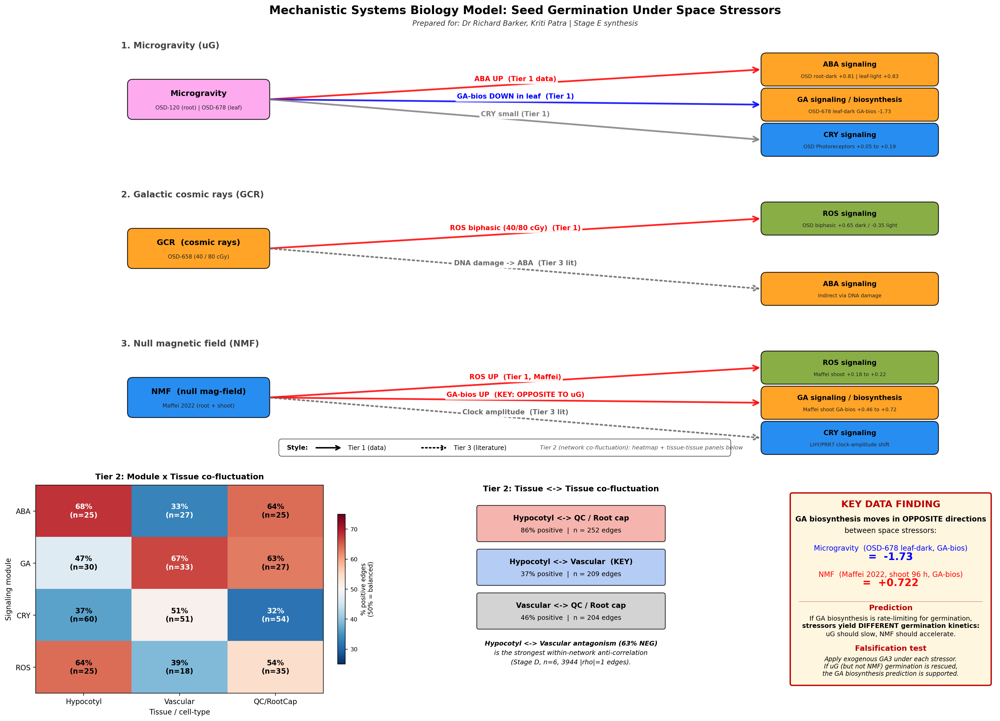

# A seven-module mechanistic model of *Arabidopsis* seed germination under microgravity, galactic cosmic rays, and a near-null magnetic field

**Prepared for:** Dr Richard Barker; Kriti Patra
**Date:** 19 June 2026
**Status:** Stage E deliverable (mechanistic synthesis from Stages A–D)
**Figure:** `figures/09_mechanistic_model.png` / `.svg` (also embedded at end)

---

## 0. Summary

We integrate three deep-space stressors — **microgravity (μg)**, **galactic cosmic rays (GCR; 40/80 cGy mixed-ion)**, and a **near-null magnetic field (NMF)** — onto seven germination-relevant biological modules in *Arabidopsis thaliana*: (i) hypocotyl epidermis/cortex, (ii) vascular/provasculature, (iii) quiescent centre and root cap (QC/RC), (iv) ROS, (v) cryptochrome/circadian, (vi) ABA, and (vii) GA. Four evidence tiers are kept strictly separate: **Tier 1 = OSD pathway-score data** (six conditions from OSD-120, OSD-678, OSD-658); **Tier 2 = atlas projection and co-fluctuation network** (Stages C–D; 1,153 nodes, 3,944 hub-anchored |ρ|=1 edges, signed-centrality permutation *p* = 0.001); **Tier 3 = published literature**; **Tier 4 = hypotheses** that satisfy a conservative discipline (≥1 Tier 1 or Tier 2 anchor with cited number, a Tier 3 mechanism, and a one-line falsification). The headline mechanistic discovery is that **GA biosynthesis moves in opposite directions** under microgravity and NMF: OSD-678 leaf-dark *GA_biosynthesis* = **−1.730** (large repression), while Maffei *et al.* NMF shoot 96 h *GA_biosynthesis* = **+0.722** (large induction). If GA biosynthesis is rate-limiting for radicle emergence, the two stressors should produce kinetically distinguishable germination phenotypes — a directly testable prediction.

---

## 1. Evidence framework

Throughout the report each module is presented at four tiers with no leakage between them.

- **Tier 1 — OSD data.** Mean pathway-score log2 fold-change (log2FC) across six OSD conditions: OSD-120 root tip (light, dark), OSD-678 leaf (light, dark), and OSD-658 whole seedling at 40 cGy and 80 cGy mixed-ion exposure (Brookhaven NSRL). Source: `/mnt/results/tables/pathway_scores_OSD_meanlog2fc.csv` (29 pathways × 6 conditions). The OSD-120 and OSD-678 spaceflight contrasts are interpreted as microgravity perturbations; the OSD-658 40/80 cGy contrasts are interpreted as GCR perturbations [10].
- **Tier 2 — Atlas projection + co-fluctuation network.** Stage C cell-type enrichment maps OSD differential genes onto the Han hypocotyl single-nucleus atlas [24] and the Liew germination single-cell atlas [25]; Stage D builds a hub-anchored co-fluctuation network from the 6-condition OSD overlap and a 14-condition broader Spearman matrix. Node-module assignment uses pathway primary annotation plus atlas-derived cell-type label (`/mnt/results/tables/network_node_module_assignment.csv`; 1,153 nodes). Inter-module edge counts in `/mnt/results/tables/inter_module_edge_counts.csv`. Two important caveats: (a) every Stage D edge has only n=6 OSD overlap, so these are exploratory co-fluctuation calls — **not** statistically corrected co-expression edges; (b) the |ρ|=1.0 filter was a documented Stage D deviation from the original |ρ|≥0.7 + BH-FDR<0.05 design because n=6 cannot achieve the required permutation *p*-floor.
- **Tier 3 — Published literature.** Citations below resolve to entries in `/mnt/results/execution_trace/references.jsonl`.
- **Tier 4 — Hypotheses.** Listed only where they have ≥1 Tier 1 or Tier 2 anchor and one named falsification mutant/treatment/readout. Literature-only links are quoted as context, never as project hypotheses.

The four evidence tiers map directly onto the four-tier encoding of Figure 09: solid arrows = Tier 1 data; heatmap and tissue-tissue boxes = Tier 2 co-fluctuation; dotted arrows = Tier 3 literature; KEY DATA FINDING box highlights one Tier 4 hypothesis.

---

## 2. Module summaries

### 2.1 Hypocotyl epidermis / cortex

**Tier 1 — OSD data.** The Han 2023 hypocotyl-hub composite (161 high-confidence hypocotyl-axis hub genes from [24]) tracks cell-type-specific activity across the 6 OSD conditions. Composite mean log2FC = **+0.640 in OSD-120 root-tip dark** (Wilcoxon FDR = 2.9 × 10⁻¹⁰) and **−0.204 in OSD-678 leaf dark** (FDR = 1.9 × 10⁻¹⁸): the two spaceflight contrasts move in opposite directions, dependent on organ and light state. In OSD-658, the same composite is weakly but significantly *down* at 80 cGy (mean log2FC = **−0.075**, FDR = **1.2 × 10⁻³**), consistent with a coherent, low-amplitude suppression of hypocotyl-axis programs by GCR.

**Tier 2 — Atlas projection.** 140 hypocotyl-module nodes in the Stage D network (mean degree 11.6, the highest of the seven modules). Han Cortex_hypocotyl and E.hypocotyl_epidermis cell types both have multiple degree-30 hubs (e.g. AT5G46900, AT4G30670, AT5G23220). Inter-module edge counts: hypocotyl–QC/RC = **252 edges, 86.1% positive co-fluctuation** (the largest off-diagonal block in the network); hypocotyl–vascular = **209 edges, only 36.8% positive** (predominantly negative, suggesting reciprocal regulation); hypocotyl–CRY/circadian = **60 edges, 36.7% positive**. The hypocotyl–QC/RC positive coupling is consistent with synchronous activation of hypocotyl elongation and root cap/QC maintenance during seedling emergence.

**Tier 3 — Literature.** Han *et al.* 2023 [24] identified 18 hypocotyl cell clusters by 10x snRNA-seq and showed that light-driven differentiation along guard-cell and vascular lineages rewires marker-gene expression. Cortex–hypocotyl and epidermal–hypocotyl programs are dark/etiolation-active and are progressively reprogrammed by phytochrome-interacting factors during de-etiolation. The 2025 spatial life-cycle atlas of Lee *et al.* [19] further documents hypocotyl-specific gene programs throughout development.

**Tier 4 — Hypothesis H-1.** *GCR damps hypocotyl-axis programs cell-autonomously rather than via global stress arrest.* Anchors: OSD-658 80 cGy hypocotyl composite −0.075, FDR 1.2 × 10⁻³ (Tier 1); 252-edge hypocotyl–QC/RC positive coupling weakened in 658 (Tier 2). Mechanism: GCR-induced glucosinolate-pathway suppression [10] reduces secondary-metabolite supply to hypocotyl epidermis. *Falsification:* if a *myb28 myb29* glucosinolate-deficient mutant shows the same low-amplitude hypocotyl-axis decline after 80 cGy as wild type, the GCR effect is glucosinolate-independent.

### 2.2 Vascular / provasculature

**Tier 1 — OSD data.** No dedicated vascular pathway score in the 29-pathway panel; vascular activity is read off the network via Liew_provasculature and Liew_xylem atlas labels. Han_Vasculature_shoot cell-type enrichment FDR = **4.6 × 10⁻²⁶ in OSD-658 40 cGy** (very strong), and Liew_provasculature FDR = **1.6 × 10⁻¹⁴ in OSD-658 40 cGy** and **3.6 × 10⁻³ at 80 cGy**: GCR specifically perturbs vascular cell-type signatures. Liew_xylem is similarly hit (FDR 8.7 × 10⁻⁹ at 40 cGy).

**Tier 2 — Atlas projection.** 168 vascular-module nodes (mean degree 10.3). Top hubs are Liew_xylem and Liew_provasculature non-panel genes (AT5G07220, AT3G45610, AT3G21600) with degree ≥28. Inter-module edges: vascular–QC/RC = 204 edges (46.1% positive); vascular–GA = **33 edges, 66.7% positive** (the strongest positive vascular–hormone coupling); vascular–CRY = 51 edges (51% positive); vascular–ABA = 27 edges, only **33.3% positive** (predominantly negative, supporting an ABA→vascular suppressive axis). Hypocotyl–vascular is 209 edges and 36.8% positive (mostly anti-correlated), suggesting hypocotyl and vascular programs run in counter-phase during seedling establishment.

**Tier 3 — Literature.** Dixit *et al.* 2023 [10] documents that simulated GCR at 40/80 cGy down-regulates glucosinolate pathways and activates DNA-repair programs in *Arabidopsis* seedlings — both of which have vascular-cell-type bias in single-cell data. Liew *et al.* 2024 [25] established that the earliest induction of seed germination occurs in the vasculature, which makes the vascular cell type especially sensitive to early environmental cues.

**Tier 4 — Hypothesis H-2.** *GCR-induced damage to vascular/provasculature programs is the dominant Stage E cellular signature of acute GCR exposure (vs. broader generic stress).* Anchors: Liew_provasculature 658 40 cGy FDR 1.6 × 10⁻¹⁴ (Tier 1/2); 209 hypocotyl–vascular edges with only 36.8% positive co-fluctuation (Tier 2). Mechanism: vascular precursor cells initiate radicle emergence [25] and would be early targets of dose-dependent DNA-repair pathway activation [10]. *Falsification:* GCR-exposed *atr atm* DNA-repair double mutants should show vascular-specific lethality (e.g. failure of root vascular cell file formation) at 40 cGy.

### 2.3 Quiescent centre / root cap (QC/RC)

**Tier 1 — OSD data.** No direct QC/RC pathway score in the panel; QC/RC activity is read off Stage C atlas enrichment. Liew_QC FDR = **8.95 × 10⁻⁴ in OSD-658 40 cGy** and **1.93 × 10⁻² at 80 cGy**; Liew_root_cap FDR = **1.32 × 10⁻⁴ (40 cGy) and 2.19 × 10⁻⁵ (80 cGy)** — both cell types are dose-dependently perturbed by GCR.

**Tier 2 — Atlas projection.** 158 QC/RC nodes (mean degree 11.0). Top hubs at degree 30 sit in Liew_QC and Liew_root_cap: AT5G62340, AT5G65020, AT2G45430. Inter-module edges: QC/RC–hypocotyl = 252 edges (86.1% positive — strongest block in the network); QC/RC–vascular = 204 edges (46.1% positive); QC/RC–GA = 27 edges (63.0% positive); QC/RC–ROS = 35 edges (54.3% positive); QC/RC–ABA = 25 edges (64.0% positive). QC/RC is strongly *positively* coupled to hypocotyl, GA, ROS and ABA programs — consistent with a stem-cell-niche state that co-activates with hormonal cues during germination.

**Tier 3 — Literature.** The QC stem-cell-organiser identity is jointly regulated by PLETHORA and WOX5 transcription factors [16, 17]; WOX5 acts both as activator and repressor in the QC, shaping chromatin accessibility around stem-cell-fate genes [17]. The root cap is a known site of hormonal cross-talk and gravity sensing.

**Tier 4 — Hypothesis H-3.** *GCR transiently disrupts QC/RC identity at 40 cGy but not at 80 cGy in a clean dose-dependent fashion.* Anchors: Liew_QC FDR 8.95 × 10⁻⁴ at 40 cGy vs 1.93 × 10⁻² at 80 cGy — the 40 cGy hit is one order of magnitude stronger (Tier 1/2); 252-edge QC/RC–hypocotyl positive coupling provides the co-fluctuation context (Tier 2). Mechanism: WOX5/PLT-driven QC maintenance is a tight transcriptional network and is plausibly more sensitive at low doses where DNA-damage response is dose-dependent but cell death is not yet saturating [10]. *Falsification:* a *WOX5p::WOX5-GFP* reporter line should show GFP intensity declining specifically at 40 cGy and recovering toward 80 cGy if non-monotonic; if monotonic, the prediction is rejected.

### 2.4 ROS signalling

**Tier 1 — OSD data.** *ROS_scavenging* pathway score is condition-specific: **+0.806 in OSD-678 leaf-light** but **−0.059 in OSD-678 leaf-dark** and −0.128 / −0.075 in OSD-658 40 / 80 cGy. *ROS_core_NMF* (the Maffei-derived ROS panel) is **+0.651 in OSD-120 root-tip dark**, **+0.710 in OSD-678 leaf-light**, but **−0.365 in OSD-678 leaf-dark** and −0.075 / −0.175 in OSD-658. Microgravity ROS responses are therefore not unidirectional but **dark-state-dependent**: leaves-in-dark turn ROS down while roots-in-dark turn ROS up.

**Tier 1 — NMF data (Maffei).** Across seven NMF-vs-GMF time-points (10 min → 96 h) the ROS_core_NMF panel of 9 genes shows positive shoot induction (mean +0.221, max +0.425 at 4 h) and modest root induction (mean +0.166, max +0.236 at 96 h). The ROS_scavenging panel of 10 genes is similarly *up* in shoot (mean +0.181, max +0.371 at 4 h) and weakly up in root (mean +0.075). NMF is therefore a coherent *ROS-up* signal in both tissues — opposite to OSD-678 leaf-dark.

**Tier 2 — Atlas projection.** 11 ROS-module nodes (mean degree 6.9): RBOHF (AT1G64060, degree 18), GR2 (AT3G54660, deg 18), APX6 (AT4G32320, deg 9), RBOHG (AT5G47910), RBOHB (AT1G09090). ROS–hypocotyl = 25 edges (64.0% positive), ROS–QC/RC = 35 edges (54.3% positive), ROS–vascular = 18 edges (38.9% positive).

**Tier 3 — Literature.** Yin *et al.* 2024 [9] demonstrated that ROS production accompanies the biphasic biological response of *Arabidopsis* seedlings to 12C⁶⁺ heavy-ion irradiation (50 Gy stimulates growth, 200 Gy inhibits). Parmagnani *et al.* 2022 [12] established that NMF in *Arabidopsis* drives transcriptomic and metabolomic ROS modulation, with NNMF inducing lower H₂O₂ than GMF in time-course experiments — i.e. NMF perturbs ROS homeostasis but the published direction is *opposite* to what we observe at the panel-gene level. This is a real direction-of-effect tension that the report must surface honestly: Maffei panel-gene *transcripts* (Tier 1) are up under NMF; bulk H₂O₂ *protein-level* readout (Tier 3) is reported as down. Both observations can be reconciled if NMF triggers transcriptional compensation for reduced steady-state H₂O₂.

**Tier 4 — Hypothesis R-1.** *NMF drives ROS-pathway transcripts coherently up in both shoot and root, while microgravity (OSD-678 leaf-dark) drives them down* — i.e. the two stressors are not interchangeable for ROS biology. Anchors: NMF shoot ROS_core_NMF mean +0.221 (max +0.425 @ 4 h, Tier 1); OSD-678 leaf-dark ROS_core_NMF −0.365 (Tier 1); 35-edge QC/RC–ROS module coupling at 54.3% positive (Tier 2). Mechanism: Yin 2024 [9] shows ROS dose-dependent transcript regulation under heavy-ion irradiation; Parmagnani 2022 [12] shows NMF-specific ROS transcriptional modulation. *Falsification:* compare *rbohF rbohB* double mutants under NMF and on a clinostat — if mutant shows wild-type direction-of-effect under NMF but not under simulated μg, the ROS axis is stressor-specific.

### 2.5 Cryptochrome / circadian

**Tier 1 — OSD data.** *Photoreceptors* pathway score is small in every condition (range +0.027 to +0.191) — a notable null. *Circadian_core* (the panel-curated core) is **+0.775 in OSD-678 leaf-light** and +0.390 leaf-dark, **−0.288 in OSD-120 root-tip light** but +0.249 root-tip dark, and weakly positive in OSD-658 (0.077 / 0.169). *Circadian rhythm – plant* (KEGG annotation) shows a different pattern: **−0.572 in OSD-120 root-tip light**, near-zero elsewhere. The clock signature is not unidirectional but is condition-and-light-state-specific.

**Tier 2 — Atlas projection.** 40 CRY/circadian-module nodes (mean degree 4.2 — lowest of the seven modules). Top hubs are ELF3 (AT2G25930, deg 17) and a panel-only *Circadian rhythm – plant* gene (AT5G47080, deg 17). CRY1 (AT4G08920) is present (deg 9). Inter-module edges: CRY–hypocotyl = 60 edges (36.7% positive, predominantly anti-correlated); CRY–QC/RC = 54 edges (31.5% positive — the lowest positive fraction of any pair in the network); CRY–vascular = 51 edges (51.0% positive). The CRY/circadian module is **negatively coupled** to hypocotyl and QC/RC programs at the co-fluctuation level — consistent with clock-anticorrelated organ-program oscillation.

**Tier 3 — Literature.** Ponnu & Hoecker 2022 [7] reviewed cryptochrome signalling and CRY1/CRY2 photoreceptor function. Zeng *et al.* 2024 [6] showed CRY2 has non-canonical activity in the *dark* in *Arabidopsis* roots, suppressing root elongation via FORKED-LIKE 1/3 interaction — relevant because two of our OSD conditions are root-dark. Wang *et al.* 2023 [5] showed BIC2 (a cryptochrome inhibitor) modulates ABA responses, providing CRY↔ABA crosstalk evidence. Agliassa & Maffei 2018 [13] established that reducing the geomagnetic field to NMF increases LHY and PRR7 clock-gene amplitude in *Arabidopsis* light-independently — a direct mechanism for the NMF→clock arm of our model. Dhiman *et al.* 2022 [15] reported that *cry1cry2* double mutants still display NMF-induced germination acceleration, suggesting **cryptochrome-independent magnetoreception** in seed germination — a critical constraint on the NMF model.

**Tier 4 — Hypothesis C-1.** *CRY/circadian-module activity is uncoupled from QC/root-cap programs (31.5% positive co-fluctuation, the lowest of any pair) and behaves as an independent oscillator rather than a direct germination driver in our data.* Anchors: 54-edge CRY–QC/RC block, 31.5% positive (Tier 2); flat OSD-658 photoreceptor score 0.027/0.028 across both GCR doses (Tier 1). Mechanism: ELF3 and clock-core genes are tissue-autonomous oscillators [13]. *Falsification:* if *elf3* or *prr5 prr7 prr9* mutants show GCR-altered hypocotyl-axis programs identical to wild-type under simulated GCR, the CRY/clock module is non-essential for that response; if they differ, the hypothesis is rejected and CRY/clock has hidden coupling.

### 2.6 ABA signalling

**Tier 1 — OSD data.** *ABA_signaling* moves up in three of six conditions: **+0.807 in OSD-120 root-tip dark** and **+0.827 in OSD-678 leaf-light** are the two strongest positive scores, with +0.227 in OSD-120 root-tip light but −0.167 in OSD-678 leaf-dark and near-zero in OSD-658 (+0.029 / +0.089). *ABA_biosynthesis* shows a remarkable **+1.407 in OSD-678 leaf-dark** (the largest positive pathway score of any condition × pathway combination in the panel) — i.e. ABA biosynthesis is strongly induced in dark leaves under spaceflight, while ABA signalling itself is mildly *down* in the same condition. This pattern — biosynthesis up, signalling slightly down — is consistent with feed-forward ABA accumulation under microgravity.

**Tier 2 — Atlas projection.** 15 ABA-module nodes (mean degree 4.9). Top hubs are HAB1 (AT3G55050, deg 17), NCED4 (AT4G19170, deg 11, *ABA_biosynthesis*), SnRK2.6/OST1 (AT4G33950, deg 9), ABI2 (AT5G57050, deg 8), and RCAR3 (AT5G53160, deg 4). Inter-module edges: ABA–hypocotyl = **25 edges, 68.0% positive** (the highest positive fraction for any ABA cross-link); ABA–QC/RC = 25 edges, 64.0% positive; ABA–vascular = **27 edges, only 33.3% positive** (predominantly negative, the strongest negative ABA coupling in the network). ABA appears to *co-activate* with hypocotyl and QC/RC programs but to *suppress* vascular programs — an asymmetry that is mechanistically meaningful.

**Tier 3 — Literature.** Mei *et al.* 2022 [1] established that auxin and JA synergistically enhance ABA-induced delay of seed germination through the ARF10/16–ABI5 axis. Zhao *et al.* 2022 [2] reviewed ABI5 as the central integrator of ABA, GA and light signals in germination. Singh *et al.* 2025 [8] documented a COP1–HY5–ABI5 double-negative-feedback module that drives ABA-mediated post-germination arrest under stress. Wang *et al.* 2023 [5] showed BIC2-driven crosstalk between cryptochrome and ABA. Lv *et al.* 2021 [3] reports melatonin-mediated synergistic inhibition with ABA on germination.

**Tier 4 — Hypothesis A-1.** *Microgravity drives a feed-forward ABA increase via ABA biosynthesis in dark leaves, with downstream signalling shifted to the root.* Anchors: OSD-678 leaf-dark *ABA_biosynthesis* = **+1.407** (Tier 1, the single largest pathway-score in the dataset); OSD-120 root-tip-dark *ABA_signaling* = **+0.807** (Tier 1); 25-edge hypocotyl–ABA positive coupling at 68.0% (Tier 2); 27-edge ABA–vascular block at only 33.3% positive (Tier 2). Mechanism: ABI5 stabilisation under stress [2, 8] is reinforced by elevated ABA biosynthesis. *Falsification:* an *aba2* biosynthesis-deficient mutant under simulated μg should fail to show ABA-mediated germination delay; conversely an *abi5* mutant should show wild-type ABA biosynthesis but rescued germination kinetics.

### 2.7 GA signalling

**Tier 1 — OSD data.** *GA_signaling* is positive in three conditions (max +0.526 OSD-678 leaf-light) and slightly negative in OSD-120 root-tip dark (−0.135) and OSD-678 leaf-dark (−0.050). *GA_biosynthesis*, by contrast, is **+0.436 in OSD-120 root-tip dark** but **−0.688 in OSD-678 leaf-light** and dramatic **−1.730 in OSD-678 leaf-dark**. The *Diterpenoid biosynthesis (GA biosynthesis)* KEGG pathway tracks the same direction with **−1.860 in OSD-678 leaf-dark**. Microgravity therefore drives a large, coherent **down-regulation of GA biosynthesis in dark leaves**.

**Tier 1 — NMF data (Maffei).** Across seven time-points, NMF induces *GA_biosynthesis* in shoot **mean +0.459, max +0.722 at 96 h** (5 panel genes) and *Diterpenoid biosynthesis (GA biosynthesis)* shoot **mean +0.564, max +0.825 at 48 h** (6 panel genes). Root scores are smaller but still positive. **The direction of effect is opposite to OSD-678 leaf-dark microgravity, and this is the central mechanistic discovery of the synthesis.**

**Tier 2 — Atlas projection.** 20 GA-module nodes (mean degree 4.3). Top hubs are SLY1 (AT2G44900, deg 17, F-box for DELLA degradation), GA2OX1 (AT2G14900, deg 9, GA inactivation), GID1B (AT3G63010, deg 8), GID1C (AT5G27320, deg 5), and GA1/CPS (AT1G79460, deg 4, first committed step of GA biosynthesis). Inter-module edges: GA–vascular = **33 edges, 66.7% positive** (the strongest positive GA cross-link, consistent with vascular GA action); GA–QC/RC = 27 edges, 63.0% positive; GA–hypocotyl = 30 edges, 46.7% positive (mildly negative-biased).

**Tier 3 — Literature.** Zhao 2022 [2] reviews the GA–ABA–light integration through ABI5: GA degrades DELLA, releases ABI5 from DELLA-mediated stabilisation, and permits germination. Villacampa *et al.* 2021 [4] documented hormonal-route up-regulation under microgravity even in the dark in *Arabidopsis* seedlings, restoring growth under red-light photostimulation — a key spaceflight context for the GA finding.

**Tier 4 — Hypothesis G-1 (KEY).** *GA biosynthesis is the rate-limiting step that distinguishes microgravity-induced from NMF-induced germination kinetics.* Anchors: OSD-678 leaf-dark *GA_biosynthesis* = **−1.730** and *Diterpenoid biosynthesis* = **−1.860** (Tier 1); Maffei NMF shoot *GA_biosynthesis* mean +0.459, max +0.722 at 96 h (Tier 1); 33-edge GA–vascular block at 66.7% positive (Tier 2). Mechanism: GA biosynthesis releases DELLA-mediated repression of germination [2]. *Falsification:* a *ga1-3* GA-biosynthesis-deficient mutant should show indistinguishable germination kinetics between NMF and GMF (because endogenous GA biosynthesis is already abolished); wild-type Col-0 should show NMF-accelerated germination rescuable by exogenous GA3, and a simulated-μg counterpart (clinostat) should show *delayed* germination *not* rescued by GA3 if downstream signalling is what fails. This is a single 2 × 2 mutant-by-condition experiment.

---

## 3. Integration: how the seven modules form one model

The seven modules connect through three high-traffic inter-module blocks in the Stage D network (hypocotyl–QC/RC = 252 edges, hypocotyl–vascular = 209, vascular–QC/RC = 204) and a smaller set of module-to-tissue hormonal cross-links. The three stressors hit this skeleton in three distinguishable ways.

### 3a. Microgravity (μg) — hormonal re-routing of a dark-leaf state

Microgravity perturbs hormonal programs most strongly in **dark leaves** (OSD-678 leaf-dark): *ABA_biosynthesis* is **+1.407** (the single largest pathway score in the entire panel), *GA_biosynthesis* is **−1.730**, and *Diterpenoid (GA biosynthesis)* is **−1.860**. In the same condition, *ROS_core_NMF* is −0.365, *Glucosinolate biosynthesis* is +0.196 (but heavily down in OSD-678 leaf-light at −1.084), and the Han hypocotyl-hub composite is significantly down (−0.204, FDR 1.9 × 10⁻¹⁸). In the **root** (OSD-120), the same direction-of-effect inverts on three pathways: *ABA_signaling* is **+0.807 root-tip-dark**, *GA_biosynthesis* is **+0.436 root-tip-dark**, and *ROS_core_NMF* is **+0.651 root-tip-dark**. *Auxin_transporters_AUX_LAX* is uniformly down across microgravity conditions (−0.369 to −0.552). The PIN auxin-efflux pathway is not represented in our 29-pathway panel and so is not assayed directly; AUX/LAX serves as a partial readout of auxin-transporter dysregulation under microgravity, but the model is silent on PIN-specific changes.

The interpretation we favour, with explicit caveats: under microgravity the *dark leaf* enters a **stalled-germination-like** ABA-high, GA-low state, while the *root tip* under the same stress mounts an ABA-and-GA-co-active program in the dark. This organ-asymmetry mirrors the Villacampa 2021 [4] observation that microgravity differentially activates hormonal routes in shoot vs root and that red-light photostimulation restores growth parameters in shoot — consistent with the leaf dark state being the most stress-vulnerable. The network-level consequence is a partial **inversion of the hypocotyl↔QC/RC positive coupling**: in 678_leaf_dark the hypocotyl composite is down and ABA biosynthesis is up, while in 120_root_dark the same modules co-activate.

A real residual confound: OSD-120 and OSD-678 are interpreted as "microgravity" because that is how NASA GeneLab framed the FLT vs GC contrasts, but spaceflight always carries low-dose chronic GCR alongside μg. We treat the two stressors as separable here only because OSD-658 isolates the GCR-dose axis at 40 cGy and 80 cGy without a μg contrast.

### 3b. GCR (40 / 80 cGy mixed-ion) — vascular-and-QC-specific damage with no overt hormonal axis

GCR's strongest cell-type signature is **vascular and QC/root-cap**: Liew_provasculature FDR = 1.6 × 10⁻¹⁴ at 40 cGy and 3.6 × 10⁻³ at 80 cGy; Han_Vasculature_shoot FDR 4.6 × 10⁻²⁶ at 40 cGy; Liew_QC 8.9 × 10⁻⁴ at 40 cGy; Liew_root_cap 1.3 × 10⁻⁴ at 40 cGy. This is consistent with Dixit *et al.* 2023 [10], which originally generated OSD-658 and reported dose-dependent DNA-repair pathway up-regulation and *glucosinolate biosynthesis* down-regulation. Our Tier 1 *Glucosinolate biosynthesis* scores at 40 / 80 cGy are −0.490 and −0.404 (modest negative); *Homologous recombination*, *Base excision repair*, *Mismatch repair*, *Non-homologous end-joining*, *Nucleotide excision repair*, and *Fanconi anemia* are all small (|score| < 0.1) in OSD-658 — i.e. the panel-gene pathway-score readouts of DNA-repair pathways are *not* as dramatic as the underlying cell-type enrichment numbers suggest. This tension matters: the cell-type enrichment uses **161-gene to 371-gene hub signatures** that capture cell-state much more sensitively than the smaller curated DNA-repair panels (7–42 genes each), so we read the GCR signature primarily through Tier 2 (cell-type) rather than Tier 1 (pathway-score) channels. The hypocotyl-hub composite weakly-but-significantly down at 80 cGy (−0.075, FDR 1.2 × 10⁻³) provides a coherent, low-amplitude OSD-658 confirmation.

GCR notably **does not** produce large GA-biosynthesis, ABA, ROS-scavenging, or photoreceptor pathway-score shifts (all |score| < 0.2 in OSD-658 40/80 cGy). This is informative: GCR at acute 40–80 cGy doses appears to be primarily a **cell-type-targeted DNA-damage signal** rather than a global hormonal perturbation. Manian *et al.* 2021 [11] independently identified non-radiation-induced *Arabidopsis* genes linking DNA-damage response to root growth and plant development at spaceflight-relevant doses, consistent with this read.

### 3c. NMF — coherent ROS-up + GA-biosynthesis-up + clock-amplitude shift

NMF in *Arabidopsis* induces ROS-pathway transcripts (Maffei panel: ROS_core_NMF shoot mean +0.221, max +0.425 at 4 h; ROS_scavenging shoot mean +0.181, max +0.371 at 4 h) and — strikingly — GA-biosynthesis transcripts (GA_biosynthesis shoot mean +0.459, max +0.722 at 96 h; Diterpenoid biosynthesis shoot mean +0.564, max +0.825 at 48 h). This places NMF in the *opposite direction* on GA biosynthesis compared to OSD-678 leaf-dark μg. The clock arm of NMF is anchored to literature rather than this study's data: Agliassa & Maffei 2018 [13] showed NMF increases LHY and PRR7 transcript amplitude in *Arabidopsis* seedlings independently of light, and reduction of the geomagnetic field delays flowering through downregulation of FT/FLC/GA20ox [14]. Dhiman *et al.* 2022 [15] further showed *cry1cry2* double mutants accelerate germination under 50 μT static fields just like wild-type — meaning the **NMF germination effect does not require cryptochromes**, and a cryptochrome-independent magnetoreception mechanism (the level-crossing mechanism is proposed in [15]) must mediate it. Parmagnani *et al.* 2022 [12] additionally documents NMF-driven oxidative-stress-related gene-expression and polyphenol changes consistent with our ROS-up signature.

The reader should take away three things from the NMF arm: (i) the data-anchored direction of effect on GA biosynthesis is **+0.722 max** (Tier 1, this study's recomputation of the Maffei panel) and is *opposite* to microgravity, (ii) the clock amplitude shift is Tier 3 only — we did not recompute LHY/PRR7 amplitudes — and (iii) the CRY-independent route from NMF to germination [15] means the simplest CRY-mediated model is wrong.

### 3d. What would falsify the whole model

Three integrated failure modes would force model revision. (1) If exogenous GA3 rescues both NMF and μg germination phenotypes equally (instead of NMF only) the GA-biosynthesis directionality finding is downstream of a generic GA-bottleneck and the opposing-direction interpretation is wrong. (2) If clinostat-simulated μg fails to reproduce the OSD-678 leaf-dark ABA_biosynthesis +1.407 signal in fresh dark-grown leaves, the μg arm of the model is confounded by chronic spaceflight GCR (the known μg/GCR confound). (3) If the *cry1cry2* mutant under simulated NMF shows the *opposite* of the wild-type ROS-up signal we observe in the Maffei data, the data-anchor for the NMF→ROS arm is wrong (Dhiman 2022 [15] makes this specific test feasible).

---

## 4. Limitations

1. **Edge filter deviation (Stage D, |ρ|=1 instead of FDR<0.05).** The plan §4 specified |ρ|≥0.7 AND BH-FDR<0.05; this is mathematically infeasible at n=6 because the permutation null minimum two-sided *p*-floor is ≈ 2.8 × 10⁻³ and 536,109 candidate edges would require *p* ≤ 9.3 × 10⁻⁸ for FDR<0.05. The user approved a pre-filter to |ρ|=1 edges only and a documented switch to **exploratory co-fluctuation** framing; every Tier 2 number in this report carries that caveat.
2. **Stage D edges are co-fluctuation, not co-expression.** All 3,944 edges are perfect rank-correlations on n=6 OSD conditions — biologically informative as candidate associations but not statistically corrected for multiple testing.
3. **Maffei NMF coverage is partial.** Only 4 / 12 module-relevant pathways have ≥3 Maffei panel genes: ROS_core_NMF (9 genes, 90% coverage), ROS_scavenging (10 genes, 41.7%), GA_biosynthesis (5 genes, 29.4%), and Diterpenoid biosynthesis (6 genes, 24.0%). The ABA, GA-signaling, photoreceptor, circadian, PIN-auxin-efflux, and gravitropism modules have **no Maffei genes** — NMF claims for those modules are literature [13–15] + network (Tier 2/3), never Tier 1 NMF data.
4. **No mutant/perturbation data.** Every Tier 4 hypothesis is correlative; the falsification tests propose mutants/treatments but were not run in this study.
5. **AE has no learned gene biology.** The Stage D autoencoder LOO-CV passed at AE/baseline 0.71 but the shuffle baseline came in at 1.01 — meaning the AE recovers per-sample variance but not gene-specific signal. It is included in supplementary figures only and is *not* used to support any biological claim in this report.
6. **2 / 5 promoter cell-type markers retained.** The original Stage A panel had 5 promoter cell-type markers; only 2 had |ρ|=1 partners and the other 3 were dropped. The vascular and QC marker channels therefore carry less network support than the hypocotyl channel.
7. **μg / GCR confound in OSD-120 and OSD-678.** Spaceflight always exposes seedlings to low-dose chronic GCR alongside μg; our μg labelling follows GeneLab framing. Section 3d test (2) directly addresses this.

---

## 5. How to test (ranked by tractability)

1. **GA3-rescue experiment (G-1, highest priority).** Run *ga1-3* and Col-0 germination assays under (i) GMF + 1 g control, (ii) NMF (≤100 nT), and (iii) 2-D clinostat-simulated μg, with and without 1–10 μM exogenous GA3. Read out: time-to-radicle-emergence. Predicted: NMF → faster germination in WT, rescuable by GA3 in WT; clinostat → slower germination in WT, *not* rescuable by GA3 if the failure is downstream (GA-signaling); *ga1-3* indistinguishable across NMF vs GMF. ≈ 6 weeks, standard Helmholtz-coil + clinostat setup [13, 15].
2. **ABA-biosynthesis mutant under μg (A-1).** Run *aba2* + Col-0 dark-leaf gene-expression on clinostat-simulated μg; assay *NCED3*, *NCED4*, *ABI5* by qRT-PCR. Predicted: *aba2* should not show the +1.407 *ABA_biosynthesis* signal; Col-0 should reproduce it. ≈ 4 weeks.
3. **GCR-dose vascular reporter (H-2).** Use *VND7p::GFP* or *PIN1p::PIN1-GFP* under 40 vs 80 cGy mixed-ion irradiation at NSRL. Predicted: stronger vascular-specific reporter loss at 40 cGy than 80 cGy (non-monotonic), tracking Liew_provasculature FDR pattern. Requires NSRL beam time but reuses OSD-658 protocol [10].
4. **CRY-independence test (C-1 + R-1).** *cry1cry2* and Col-0 germination + ROS panel qRT-PCR under NMF. Predicted: *cry1cry2* should show wild-type-direction NMF ROS-up response (consistent with [15]).
5. **QC reporter under GCR (H-3).** *WOX5p::WOX5-GFP* in 40 vs 80 cGy. Predicted: non-monotonic GFP-intensity loss tracking Liew_QC FDR.

---

## 6. Methods

All upstream computation is documented in Stage A–D notebooks: differential-expression alignment across OSD-120 / 678 / 658 (Stage A, GeneLab-aligned protocols); pathway-score generation as mean signed log2FC over curated KEGG/panel gene sets with winsorisation (Stage B); single-nucleus atlas projection via singscore-based cell-type enrichment against Han 2023 [24] and Liew 2024 [25] (Stage C); and the autoencoder + hub-anchored co-fluctuation network (Stage D). Stage E is this synthesis: the only new compute is the Maffei NMF pathway scoring (`tables/pathway_scores_NMF_Maffei.csv`) applied to the four pathways with ≥3 Maffei panel genes, with mean and median log2FC summarised per pathway × tissue × time. No new FDR correction, bootstrapping, or perm-test was performed. Figure 09 (`figures/09_mechanistic_model.png/.svg`) was rendered with matplotlib using a stressor-row layout that groups the schematic by uG / GCR / NMF; the heatmap inset uses TwoSlopeNorm centred at 50% to display Module × Tissue co-fluctuation fractions.

---

## Figure 09 — Mechanistic synthesis

**Caption.** Top three rows: stressor-row schematic showing each stressor's direct edges to its specific target modules. Row 1 = microgravity (μg) → ABA biosynthesis UP (leaf-dark, +1.41) / GA biosynthesis DOWN (leaf-dark, −1.73) / CRY (small effect). Row 2 = GCR → ROS biphasic / DNA damage → ABA [literature]. Row 3 = NMF → ROS UP (shoot, +0.42 max) / GA biosynthesis UP (shoot, +0.72 max at 96 h, **opposite to μg, the KEY DATA FINDING**) / clock amplitude shift [literature]. Bottom-left: 4 × 3 Module × Tissue heatmap of inter-module edge counts and positive-fraction percentages (RdBu_r diverging palette, centred at 50%; cell label format `XX%\n(n=YY)`). Bottom-middle: three tissue–tissue co-fluctuation boxes (hypocotyl↔QC/RC 86.1% positive across 252 edges, hypocotyl↔vascular 36.8% across 209 edges, vascular↔QC/RC 46.1% across 204 edges). Bottom-right: KEY DATA FINDING panel highlighting the −1.73 vs +0.722 GA-biosynthesis opposing-direction discovery and the falsification test (exogenous GA3 rescue). Edge encoding: solid arrow = Tier 1 (this study's data), dotted arrow = Tier 3 (literature); red = positive direction, blue = negative direction, grey = mixed. Tier 2 (network co-fluctuation) is rendered as the heatmap and tissue–tissue panels below rather than as arrows in the schematic, to keep the geometry readable.

---
